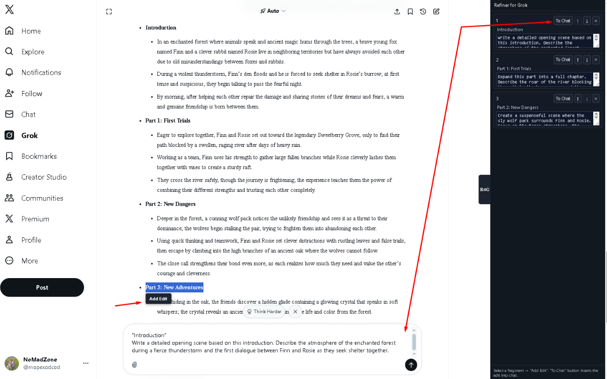
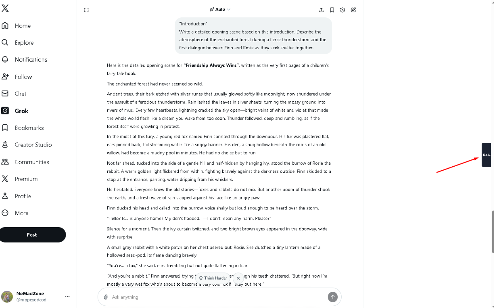
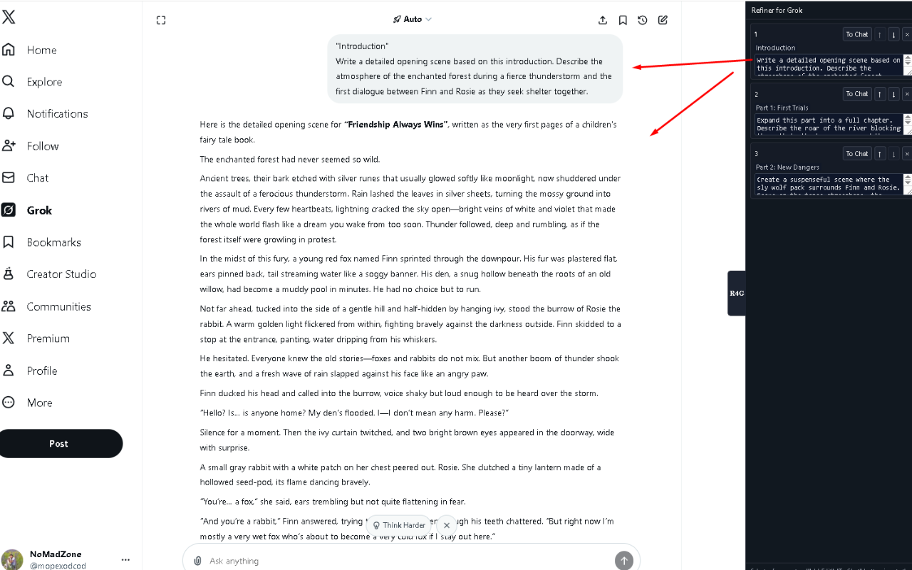

# Refiner for Grok

Refiner for Grok is a Chrome extension that adds a control layer on top of Grok's interfaces. It is designed for users who work with AI on texts, code, and data on grok.com and Grok integrated into x.com.

## Problem
When working with Grok, you often need to refine specific fragments of a response rather than the entire output. Attempting to do this directly in chat leads to the AI changing things you didn't want changed, losing discussion context, and forcing manual copy-pasting that clutters the clipboard.

## Solution
Refiner for Grok provides a separate workspace right in your browser. It allows you to isolate selected text fragments, prepare precise instructions for each fragment, and avoid interfering with the main AI conversation flow.

## Disclaimer
An unofficial Chrome extension for a more convenient experience with Grok from xAI. Not affiliated with xAI or Elon Musk.

## Workflow
1. **Select Text**: User selects any text on the Grok page, and a contextual "Add Edit" button appears next to the selection.
2. **Collect Fragments**: Clicking the button sends the fragment to the side panel.
3. **Edit**: A list of selected fragments forms in the side panel. For each, you can add a comment specifying exactly what needs to be changed, clarified, or reworked.
4. **Insert to Chat**: The "To Chat" button inserts the "Quote + Comment" pair into Grok's input field.
5. **Control**: The user manually sends the message — the extension does not submit requests automatically.

## 📸 Screenshots

### 1. Full Workspace & Workflow
Refiner for Grok adds a powerful side panel and floating tools to your chat. Select any text, click "Add Edit", and manage your instructions in one place.


### 2. Stealth Mode
The extension stays out of your way. When not in use, it collapses into a discreet handle that doesn't interfere with the Grok interface.


### 3. Precision Editing
Manage multiple fragments and send structured prompts back to Grok with a single click.


## Technical Features
- **Compatibility**: Works on grok.com and Grok within x.com.
- **Isolation**: Uses an isolated iframe for stable operation without conflicts with the site interface.
- **Data Persistence**: Selected fragments and comments are stored in the browser's local storage, ensuring data safety when closing tabs or switching between sites.

## Installation for Developers

1. Clone the repository:
   ```bash
   git clone https://github.com/Mopexod/grok-refiner.git
   cd grok-refiner
   ```

2. Install dependencies:
   ```bash
   npm install
   ```

3. Build the extension:
   ```bash
   npm run build
   ```

4. Load the extension in Chrome:
   - Open `chrome://extensions/`
   - Enable "Developer mode"
   - Click "Load unpacked extension"
   - Select the `grok-refiner` project folder

## Conclusion
Refiner for Grok is a professional tool for precise, controlled work with AI responses. It eliminates manual copy-pasting, reduces errors, and allows you to manage the quality of every individual response fragment.

## ❤️ Support Refiner for Grok

Crypto donations (preferred):

- **USDT (TRC-20 on Tron)** — recommended, low fees:  
  `TZBZfZfC4mvN4KVAEwR76bW2JCGYdwdcTN`

- **Monero (XMR)** — privacy-focused:  
  `84uqBgVtzq375fs7qfPhtLR5R3fLnmJkZSLdfCaLeenq2JUT6NMSiRTCQtbkS4NVpef5h9YKdhM148q4gWBKqzzx8MUjbSY`

- **Bitcoin (BTC)** — classic:  
  `bc1q4dpgjjmjaq8zpk2wg2s2dzl3r4dawgz8whmtv4`

- **TON** — via Telegram [@wallet](https://t.me/wallet) bot to [@mopexodcod](https://t.me/mopexodcod):  
  `UQD-jREq1AwUJBWKcSQjJd7Lki-Hay0WceLwROu8VvSyJN0G`

Thanks! 🚀

## License
MIT
